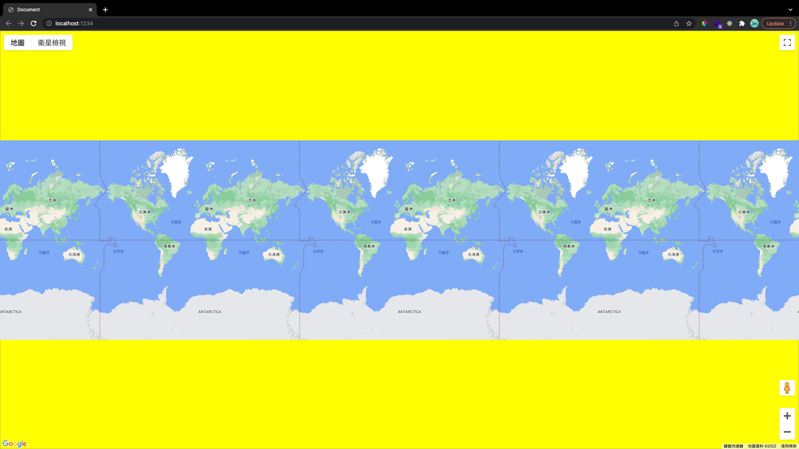

# Why do we need TypeScript?

> TypeScript was voted the second most loved programming language in 2020 (third in 2021).  
> What's about it that's make it so lovable?

## What problem it's trying to solve

### 1. Catching mistakes early on

By using TypeScript, we can catch errors before our code is executed

```js
// test.js
let arr = []

orr.push() // no error shows
```

```ts
// test.js
let arr = []

orr.push() // Cannot find name 'orr'.
arr.trim() // Property 'trim' does not exist on type 'any[]'.
```

Through TypeScript's type system, we can spot potential errors (typos or wrong methods) before code gets executed.

### 2. Helping developers to figure out how to use third-party modules

My favourite part about TypeScipt is that a type information can be provided about a module in `index.d.ts` file.

Let's take [Google Map JavaScript API](https://developers.google.com/maps/documentation/javascript?hl=en) as an example.

```js
// tutorial code provided by Google doc

var myLatlng = new google.maps.LatLng(-34.397, 150.644)
var mapOptions = {
    zoom: 8,
    center: myLatlng,
    mapTypeId: 'satellite',
}
var map = new google.maps.Map(document.getElementById('map'), mapOptions)
```

Before TypeScript, we need to rely heavily on documentation to figure out how to use a module.

Now, with the help of type information defined in `index.d.ts`, we can quickly find out what type of info is needed to use a module.

```ts
// index.d.ts

declare namespace google.maps {
  class Map extends google.maps.MVCObject {
    constructor(mapDiv: HTMLElement, opts?: google.maps.MapOptions);
    .
    .
    .
    .
    .
  }
}
```

Code above tells us that `google.maps.Map()` needs a `mapDiv` that is `HTMLElement` type and an `opts` that fits into `MapOptions` type as arguments for the `constructor` method of `Map`.

We can ⌘ + click to the definition of `MapOptions` and we can see what forms this type.

```ts
// index.d.ts

interface MapOptions {
    /**
     * Color used for the background of the Map div. This color will be visible
     * when tiles have not yet loaded as the user pans. This option can only be
     * set when the map is initialized.
     */
    backgroundColor?: string|null;
    /**
     * The initial Map center.
     */
    center?: google.maps.LatLng|null|google.maps.LatLngLiteral;
    .
    .
    .
    .
    .
}
```

By just looking at these lines of code, we know that `opts` is an object and can have the properties listed inside `MapOptions`.

So instead of following the tutorial code we saw, we decide to write something like:

<!-- prettier-ignore -->
```ts
new google.maps.Map(
  document.getElementById(divId), 
  { 
    backgroundColor: 'yellow', 
    center: { lat: 0, lng: 0 }, 
    zoom: 1 
  }
)
```

We are confident `backgroundColor` property will work because it's listed inside `MapOptions`, and by just looking at that line of code we know it accepts type `string` or `null`.

This is how the map looks like:



## End

There're plenty of reasons why we need TypeScript beside the two points I mention in this article.  
Personally, I enjoy writing code in TypeScript more than JavaScript, and I can't wait to use more TypeScript in my future project.
