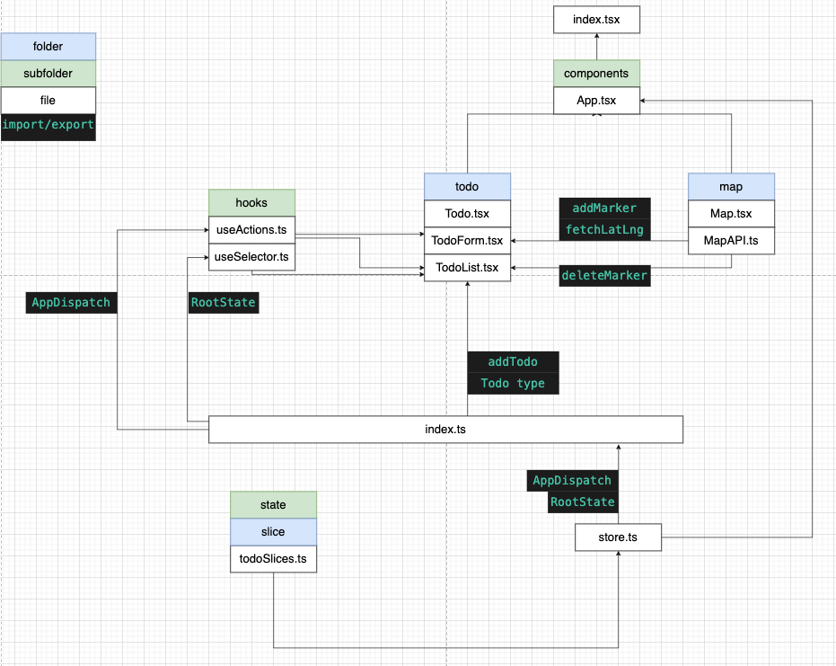

# Custom Hooks



Today, we'll set up custom hooks.

> Custom hooks are functions that may call others hooks, like `useState()` or `useEffect()`. We use them to reuse stateful logic between components.

```ts
// useActions.ts
import { AppDisptch } from '../state'
import { useDispatch } from 'react-redux'

export const useActions = () => useDispatch<AppDisptch>()
```

We passed `RootState` we defined earlier to `TypeUseSelectorHook` to make sure the type of state returned from `useSelector` is matched with the one we defined in `store`.

```ts
// useSelector.ts
import { useSelector as _useSelector, TypedUseSelectorHook } from 'react-redux'
import { RootState } from '../state'

export const useSelector: TypedUseSelectorHook<RootState> = _useSelector
```

We'll be using `useSelector` to extract data from store, and `useActions` to dispatch an action.

That'll be all for today.
