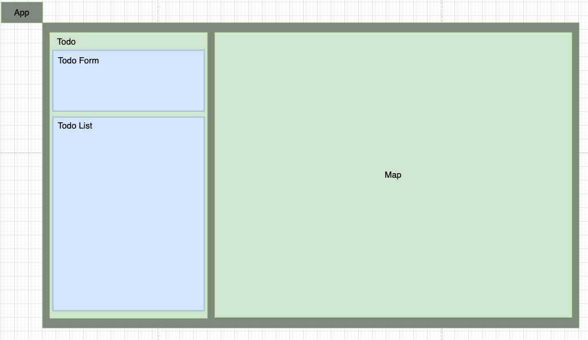

# HTML of TodoForm and TodoList



This is the component structure. Today, we'll focus on building the html of `TodoForm` and `TodoList` without any functionality and style.

```ts
const TodoForm = () => {
    return (
        <form className="todo__form">
            <div className="todo__todo">
                <label htmlFor="todo">Todo</label>
                <input id="todo" className="todo__input--todo" />
            </div>
            <div className="todo__address">
                <label htmlFor="address">Todo</label>
                <input id="address" className="todo__input--address" />
            </div>
            <button>Submit</button>
        </form>
    )
}

export default TodoForm
```

```ts
import todoSlices from '../../state/slices/todoSlices'

// dummy data
const todos = [
    { todo: 'grocery shopping', address: 'New Taipei City' },
    { todo: 'Pokemon', address: 'Daan Park' },
]

const TodoList = () => {
    return (
        <ul className="todo__list">
            {todos.map((todo, i) => {
                return (
                    <li className="todo__item" key={i}>
                        <div className="todo__desc">
                            <span>{todo.todo}</span>
                            <span>{todo.address}</span>
                        </div>
                        <button className="btn--delete">X</button>
                    </li>
                )
            })}
        </ul>
    )
}

export default TodoList
```

For the icon of `button`, you can go to [iconmoon](https://icomoon.io/) and download delete icon you find suitable.

After you have the `svg` file, import it in the `TodoList` component.

```ts
import { ReactComponent as DeleteIcon } from './cross.svg'
```

Remember to define the type for `svg` file. Otherwise, webpack doesn't know its type declaration and can't compile it.

```ts
// declarations.d.ts
declare module '*.svg' {
    import React = require('react')
    export const ReactComponent: React.SFC<React.SVGProps<SVGSVGElement>>
}
```

and remember to include this file in `tsconfig.json` file

```json
// tsconfig.json
{
    "include": ["src", "declarations.d.ts"]
}
```

## File Structure

```text
todolist-with-map-demo
├── node_modules/
├── public/
├── src/
│  ├── components
│  │   ├── todo
│  │   │   ├── +cross.svg
│  │   │   ├── +TodoForm.tsx
│  │   │   └── +TodoList.tsx
│  │   └── App.tsx
│  ├── hooks
│  ├── state
│  ├── styles
│  └── index.tsx
├── .gitignore
├── package-lock.json
├── package.json
├── READMD.md
├── +declarations.d.ts
└── tsconfig.json
```

references:  
[Importing Other Assets](https://webpack.js.org/guides/typescript/#importing-other-assets)  
[Unable to import svg files in typescript](https://stackoverflow.com/questions/44717164/unable-to-import-svg-files-in-typescript)
