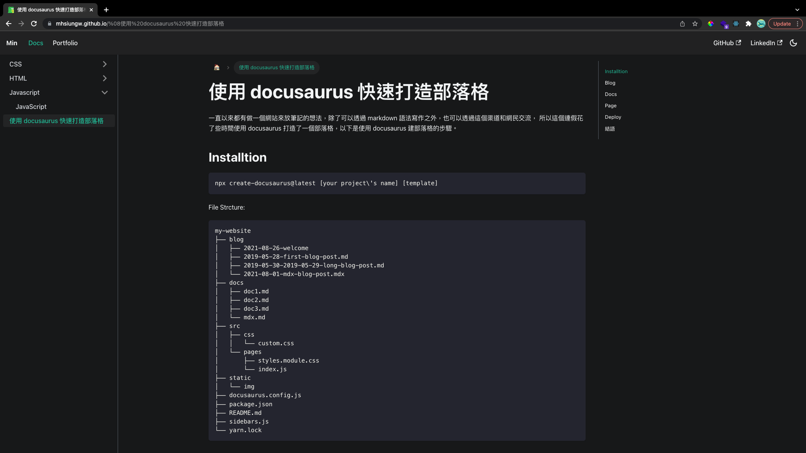

# min's blog

## Intro

my personal blog.

1. [github repo](https://github.com/mhsiungw/mhsiungw.github.io)
2. [min's blog](https://mhsiungw.github.io/)

## Tech Stack

1. [docusaurus](https://docusaurus.io/)
2. [Github Pages](https://pages.github.com/)

## Why I build it

1. to share what interests me and make notes on it.
2. to connect with netizens (it now seeems difficult due to the low site ranking...)

## What can be improved

1. SEO
2. needs an About Me page
